# SKF-Chatbot Updates [GSOC'19]

### What is SKF?
Security Knowledge Framework (SKF) is a tool that is used as a guide for building and verifying secure software. It can also be used to train developers about application security. The OWASP Security Knowledge Framework is an expert system web-application that uses the OWASP Application Security Verification Standard and other resources. It can be used to support developers in pre-development (security by design) as well as after code is released (OWASP ASVS Level 1-3).

### Introduction of SKF-Chatbot:

#### What is Chatbot?
Chatbots are software agents that interact with the user in a conversation. A chatbot is a service which is provided by websites so that users can easily able to fetch information interactively. They can reach out to a large audience on messaging apps and be more effective. A chatbot provides a speedy and quick response and available around the clock. Chatbot will be an attempt to reduce the pain of the user and will help users in finding solutions to their problems and thus improving the security of code and infrastructure.

#### What is SKF-Chatbot?
SKF-Chatbot is the bot which will help you with the details or answer your queries about the different vulnerabilities. The bot can be asked about the **description, solution** of the vulnerability and also help you with the **code snippet** in various languages.
**Language Supported: Django, Java, Flask, Php, Ruby**

##### For ex: If you ask What is XSS?
It will answer you with the description of xss.
**Something like this:** Description for xss injection is : Every time the application gets userinput, whether this showing it on screen or processingthis data in the application background, these parameters should be escaped for maliciouscode in order to prevent crosssite scripting injections.When an attacker gains the possibility to perform an XSS injection,he is given the opportunity to inject HTML and JavaScript code directly into theapplication. This could lead to accounts being compromised by stealing session cookies or directly affect the operation of the target application. 

Similarly, you can ask for the **solution** like: How to solve xss, How to resolve csrf etc. And for the **code** example it can be like code for xss filtering in java. 

## SKF-Chatbot Telegram Version:
Dialogflow Telegram Integration allows you to easily create Telegram bots with natural language understanding based on the Dialogflow technology.
## Creating a Bot in Telegram
-	Login to Telegram and go to https://telegram.me/botfather
-	Click the Start button in the web interface or type /start
-	Click on or type /newbot and enter a name
-	Enter a username for the bot, ending in "bot" (e.g. skf_chatbot)
-	Copy the generated access token

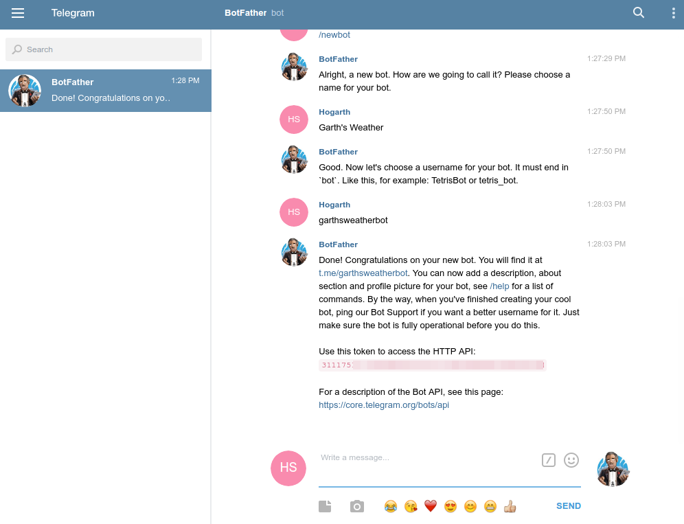
 
## Setting Up Dialogflow
-	In Dialogflow, go to Integrations in the left hand menu
-	Click on the Telegram tile
-	Paste the Access Token into the related field
-	Click the Start button

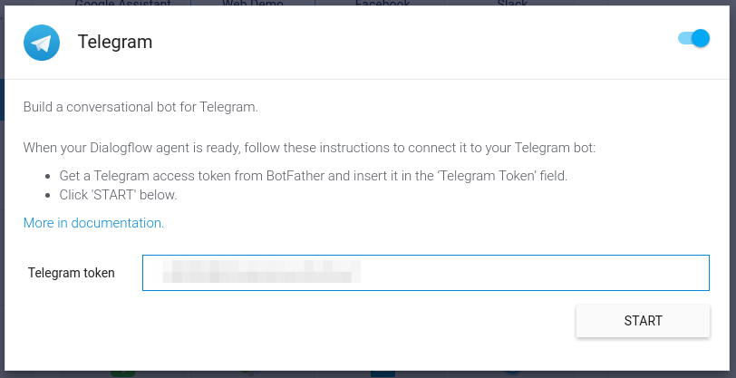

 
### Go to this link to test out our agent:

#### [Telegram bot](https://web.telegram.org/#/im?p=@skf_chatbot)

#### For More Guidance, Check this: https://medium.com/@hemantjain1999/dialogflow-integration-with-telegram-4048e16397fc?source=friends_link&sk=414edb0208fd5132cf603260a3dc2467

## SKF-Chatbot Facebook Version:

The Dialogflow Facebook integration allows you to easily create a Facebook Messenger bot with natural language understanding, based on the Dialogflow technology.

### Setting Up Facebook

In order to set up the Facebook integration for your agent, you'll need the following:
-	a Facebook account
-	a Facebook page to add your agent to When a user visits your page and sends you a message, they'll be talking to your agent.

### Create a Facebook App
-	Log into the Facebook Developer Console.
-	Click on My Apps in the upper right hand corner.
-	Click on Add a New App and enter a name and contact email address
-	Click Create App ID.

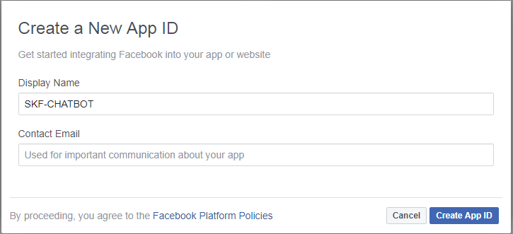

 
-	On the next page, click the Get Started button for the Messenger option.
-	Under the Token Generation section, choose one of your Facebook pages.
-	This will generate a Page Access Token. Keep this token handy, as you'll need to enter it in Dialogflow.

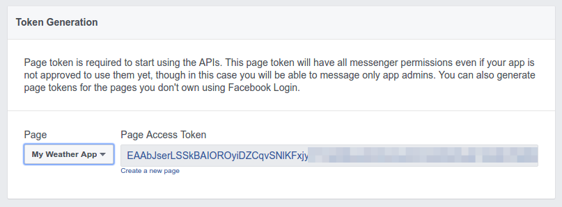

### Setting Up Dialogflow
-	Click on the Integrations option in the left menu and switch on Facebook Messenger. In the dialog that opens, enter the following information:
-	Verify Token - This can be any string and is solely for your purposes
-	Page Access Token - Enter the token generated in the Facebook Developer Console
-	Click the Start button.

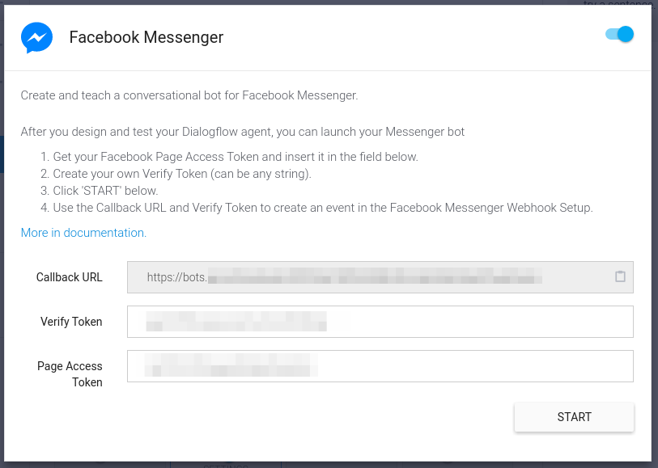

 
### Go to this link to test out our agent:
#### [Facebook bot](https://www.facebook.com/SKF-Chatbot-869613130068384/?view_public_for=869613130068384)
 
#### For More Guidance, Check this: https://medium.com/@hemantjain1999/dialogflow-integration-with-facebook-messenger-d0ee06784619?source=friends_link&sk=5fc030228443478c72155516d4723952

## SKF-Chatbot Desktop Version:

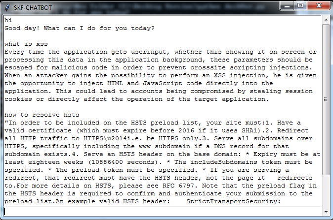

 
## SKF-Chatbot Slack Version:

Dialogflow's Slack Integration makes it easy to create your own Slack apps and bots and train them to understand natural language.

### Setting Up Slack

In order to set up the Slack integration for your agent, you'll need the following:
-	a Slack account
-	a Slack Team

### Create a Slack App

-	Navigate to the Slack Developer Console
-	Enter a name for your app
-	Choose a Team you would like the app associated with
-	Click the Create App button
 
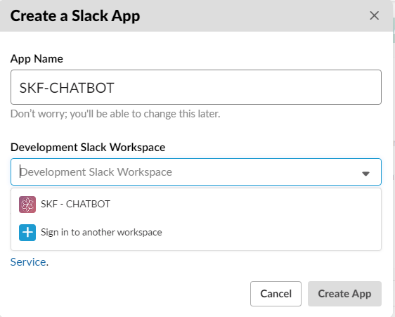
 
### Add a Bot User
-	Click on Bot Users in the left hand menu
-	Click the Add a Bot User button
-	Enter a name for your Slack bot (this is what users will see they add your bot)
-	Enable Always Show My Bot as Online
-	Click the Add Bot User button

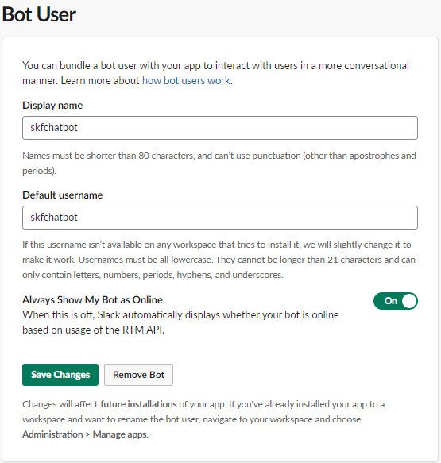

### Enabling Integration in Dialogflow
-	In the Slack Developer Console, click on Basic Information in the left hand menu and scroll down to the App Credentials section. Make note of the Client ID, Client Secret, and Verification Token.

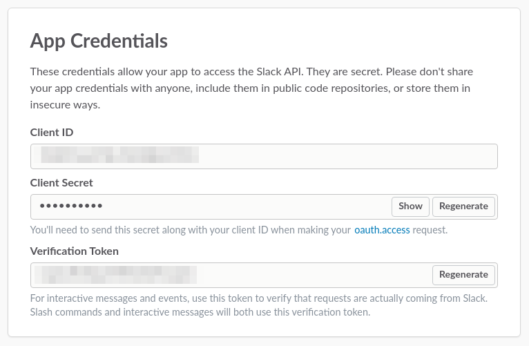

### Link Slack to Dialogflow
-	In Dialogflow, go to Integrations in the left hand menu
-	Click on the Slack tile
-	Enter the related values into the following fields: a) Client ID b) Client Secret c) Verification Token
-	Click Start

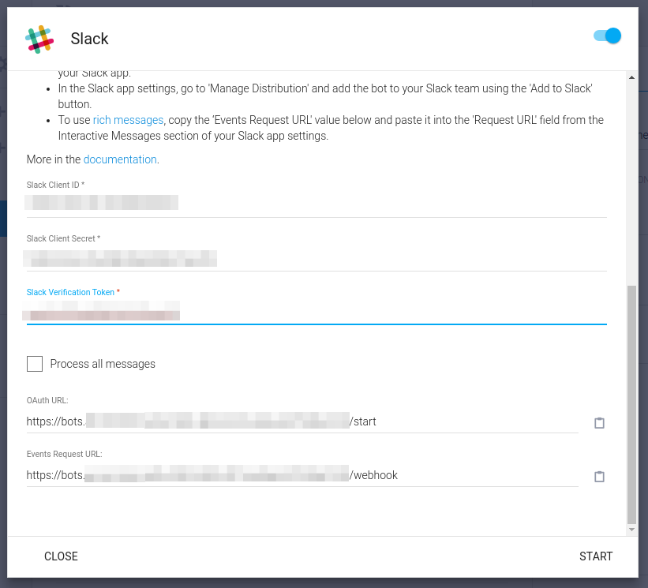

### Go to this link to test out our agent:
#### [SKF-Chatbot Slack Version](https://join.slack.com/t/skf-chatbot/shared_invite/enQtNzE3NjgxODI0NTE2LTgyZGI3NzJjM2MyZDNmOWU3ZjRkNzk3NzRmN2FiMjI1NjBmM2RkYWQxNDMwMmEyYzU5Mzc2ZmE1ODRhMjI5YjQ)

#### For More Guidance, Check this: https://medium.com/@hemantjain1999/dialogflow-integration-with-slack-cb72f8f37fd2?source=friends_link&sk=1dc35b0abfe69dd6aa29082ec557b2a6

## SKF-Chatbot Web Version:
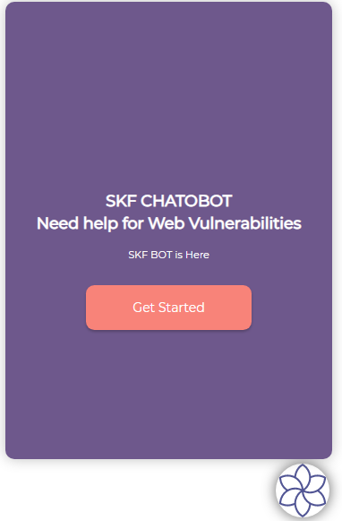          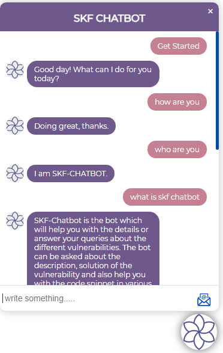
