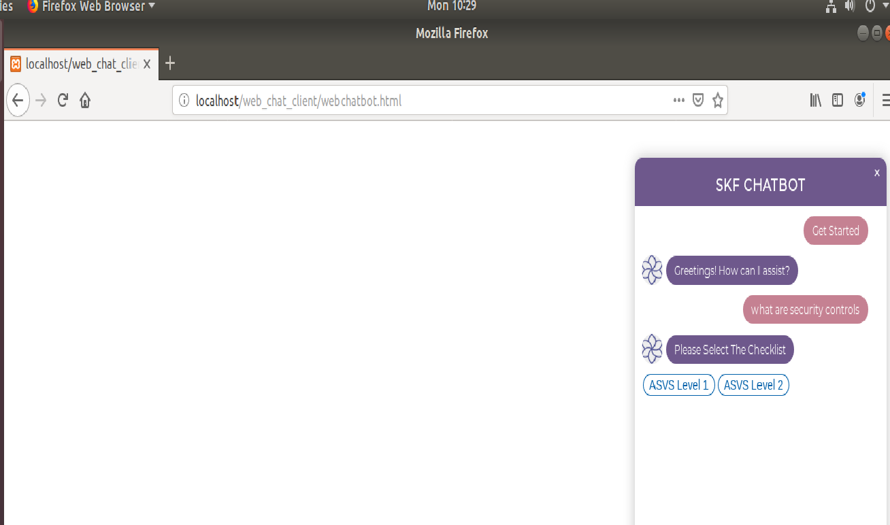

# SKF Chatbot Extension

##### How I have created Telegram bot?
Firstly, we need to create a new bot using Bot Father.

The following steps describe how to create a new bot using Bot Father:

- Contact @BotFather in your Telegram messenger
- To get a token, send BotFather a message that says /newbot
- When asked for a name for your new bot choose something that ends with the word bot. For example, my_test_bot
- If your chosen name is available, BotFather will send you a token
- Save the token

This token will be used when you will be linking your bot with Dialogflow. In Dialogflow you need to create intents for all the questions you want the bot to answer. After that you can integrate it on different platforms.

You can access SKF Telegram bot on the following link:

#### [Telegram bot](https://web.telegram.org/#/im?p=@skf_chatbot)

